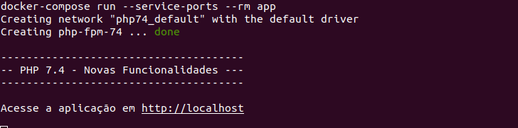

## PHP 7.4 - Novas Funcionalidades

Este repositório é parte integrante do artigo [PHP 7.4 - Novas Funcionalidades](https://blog.taller.net.br/ "PHP 7.4 - Novas Funcionalidades") publicado no [blog da Taller](https://blog.taller.net.br/ "blog da Taller").

Nesse artigo mostramos como usar as novas funcionalidades oferecidas nessa nova versão da linguagem PHP. Entretanto, você também pode baixar esse projeto e iniciar o ambiente para fazer seus testes.

### Requisitos

- [Docker](https://docs.docker.com/install/ "Docker")
- [Docker Compose](https://docs.docker.com/compose/install/ "Docker Compose")

### Como usar?

##### 1 - Clone o projeto

`$ git clone git@github.com:rrmontuan/php74.git`

##### 2 - Acesse o diretório do projeto

`$ cd php74`

##### 3 - Execute o ambiente

Esse projeto utiliza o docker para configuração do ambiente de desenvolvimento. Sendo assim, precisaremos baixar as imagens e iniciar o projeto em seguida. Para fazer isso você só precisa executar o comando abaixo:

`$ docker-compose run --service-ports --rm app`

ou apenas `$ make run`, caso você tenha o make instalado em seu SO.

##### 4 - Acessando a aplicação

Se tudo tiver funcionado, você verá a mensagem abaixo em seu terminal:

Basta então acessar a aplicação pelo endereço abaixo:

[http://localhost](http://localhost "http://localhost")

##### 5 - Criando seus arquivos

Caso você queira testar as funcionalidades do PHP 7.4 é bem simples. Basta criar seus arquivos php dentro do diretório **/app**. Como exemplo, podemos criar o arquivo **testando.php**e acessá-lo através do seguinte endereço:

[http://localhost/testando.php](http://localhost/testando.php "http://localhost/testando.php")
